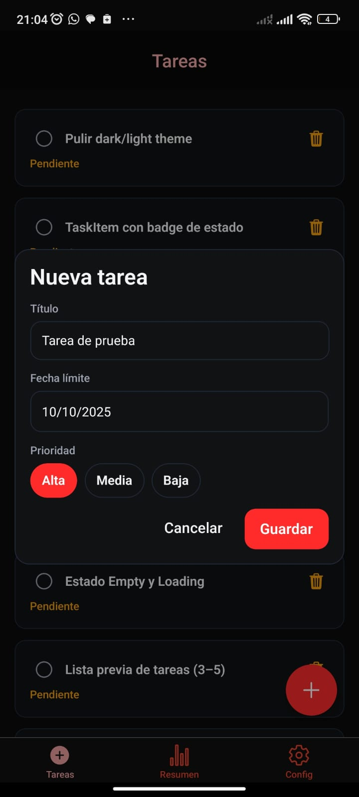
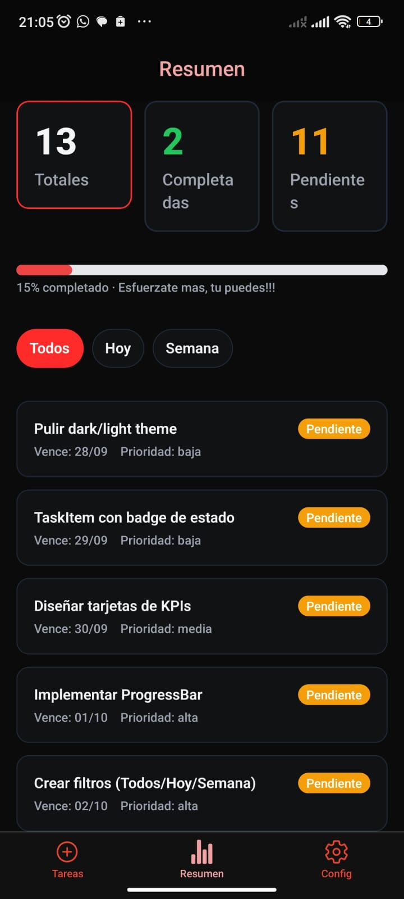

# handy-tasks
To-do list

# Handy Tasks ✅

Aplicación de gestión de tareas con autenticación segura y manejo de usuarios.  
Desarrollada con **Spring Boot (backend)** y **React Native/Expo (frontend)**.  

## 🚀 Descripción
Handy Tasks es una aplicación móvil que permite a los usuarios **registrarse, iniciar sesión y administrar sus tareas** de manera sencilla y segura. La seguridad se implementa mediante **JWT (JSON Web Tokens)**, lo que garantiza que solo los usuarios autenticados puedan acceder a sus datos personales y tareas.

---

## 🔑 Autenticación con JWT
- **Registro (Register):**
  - El usuario crea una cuenta proporcionando email, username y contraseña.
  - La contraseña se almacena de forma segura (encriptada).
  - Una vez registrado, se puede iniciar sesión.

- **Inicio de sesión (Login):**
  - El usuario envía email y contraseña.
  - Si las credenciales son válidas, el servidor genera un **JWT**.
  - Este token se devuelve al cliente y debe enviarse en cada request a endpoints protegidos.
  - El token identifica al usuario autenticado y evita la necesidad de reenviar credenciales.

- **Protección de rutas:**
  - Todas las rutas de usuarios y tareas requieren un JWT válido.
  - El token expira al hacer logout o manualmente al eliminarlo del dispositivo.

---

## 👤 Funcionalidades de Usuarios
- **Registro e inicio de sesión** con validaciones.
- **Perfil de usuario:** visualización de datos básicos (email, username).
- **Seguridad:** solo el usuario autenticado puede acceder a su propia información.

---

## 📝 Funcionalidades de Tareas
- **Crear tarea:** cada usuario puede registrar tareas con título y descripción.
- **Listar tareas:** se muestran únicamente las tareas del usuario autenticado.
- **Editar tarea:** actualizar título o descripción de una tarea existente.
- **Marcar como completada:** cambiar estado de una tarea a “hecha”.
- **Eliminar tarea:** borrar una tarea definitivamente.
- **Filtrar por estado:** ver tareas completadas o pendientes.

---

## ⚙️ Tecnologías utilizadas
- **Backend:** Spring Boot 3, Spring Security, JWT, JPA/Hibernate, PostgreSQL/MySQL.  
- **Frontend:** React Native (Expo), Axios para requests al backend.  
- **Autenticación:** JSON Web Tokens (JWT).  

---

## 📸 Screenshots - Backend

| Backend en funcionamiento | Register | Token JWT |
|---------------------------|----------|-----------|
|  |  |  |

| Login | Petición Http Get | Petición Http Get Todos |
|-------|-------------------|-------------------------|
|  |  |  |

| Petición Http Post (crear tarea) | Petición Http Get (tareas completadas) |
|----------------------------------|----------------------------------------|

| Vista de registro | Vista de inicio de sesión |
|-------------------|---------------------------|
|  |  |

| Tab de tareas | Pop up de creación de tarea |
|---------------|-----------------------------|
|  |  |

| Tab de resumen | Bar progress (variación) |
|----------------|---------------------------|
|  | .png) |

